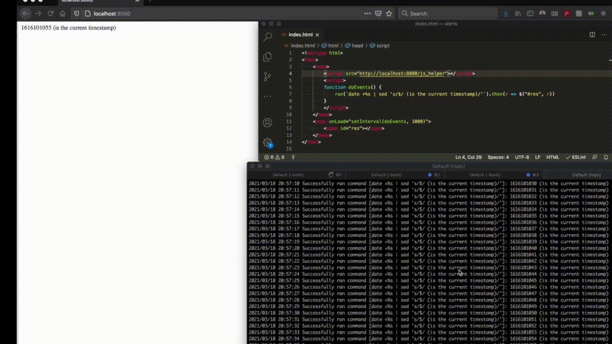

# termserve - Run terminal commands on the frontend!



## Why? Effortless prototyping!

- Terminal provides maximum flexibility for backend (including `rm -rf /`)
- HTML/CSS/JS provides maximum flexibility for frontend

## Usage

1. Install with `go get https://github.com/marianogappa/termserve`
2. Create an index.html and serve it with `termserve /path/to/index.html`

## Template HTML to start with

```html
<!doctype html>
<html>
    <head>
        <script src="http://localhost:8080/js_helper"></script>
        <script>
        function doEvents() {
            run(`date +%s | sed 's/$/ (is the current timestamp)/'`).then(r => $("#res", r))
        }
        </script>
    </head>
    <body onLoad="setInterval(doEvents, 1000)">
        <span id="res"></span>
    </body>
</html>
```

- The `js_helper` dependency adds the `run` function and a convenience `$` function that does `document.querySelector(q).innerHTML = v`.
